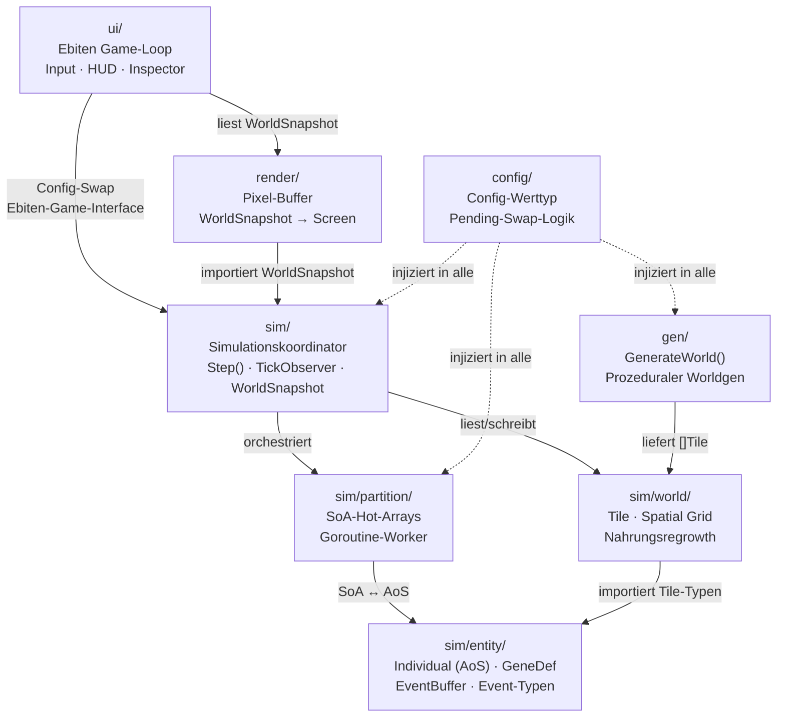
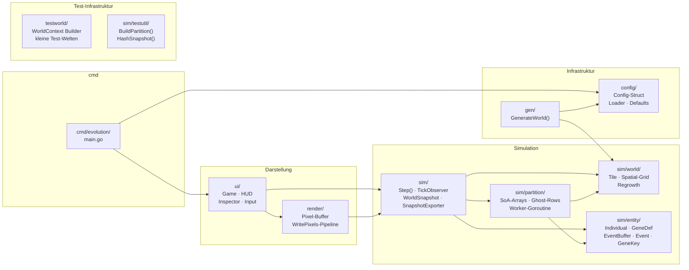
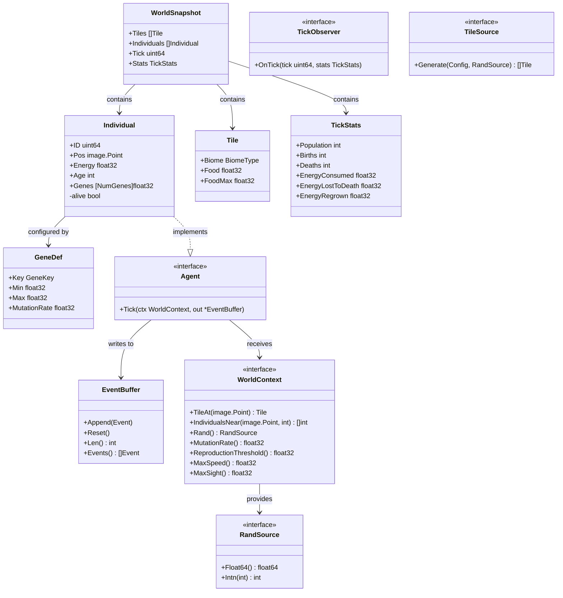
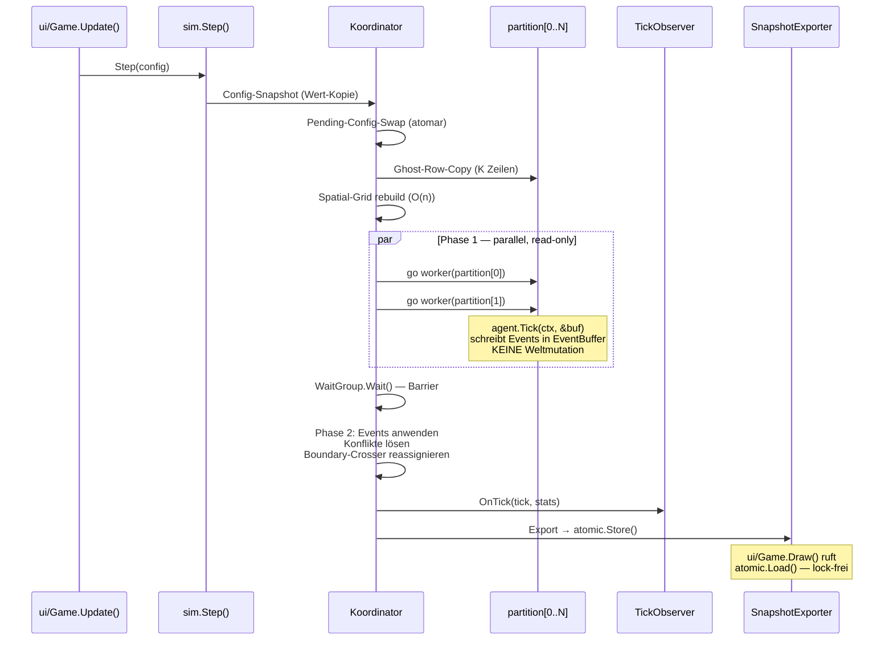
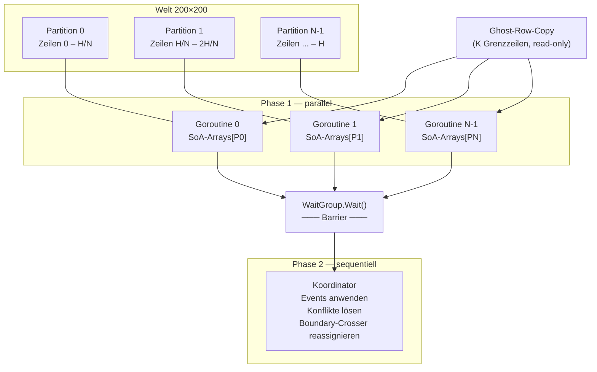
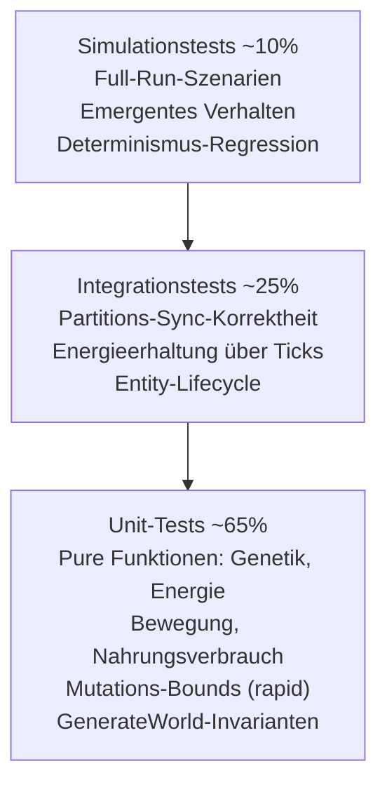

# Evolution Simulation — Architektur

> Erarbeitet durch strukturierte Multi-Agenten-Diskussion (GoArchitect · PerfArchitect · QualityArchitect · TestArchitect).

---

## 1. Überblick

**Ziel:** Biologisch inspirierte Echtzeit-Simulation, die Evolution durch natürliche Selektion sichtbar macht.

**Technologie-Stack:**

| Komponente | Technologie | Begründung |
|---|---|---|
| Sprache | Go 1.22+ | Goroutinen, GC-Kontrolle, natives Deployment |
| Rendering | Ebiten v2 | 2D-Engine, `WritePixels`-API, kein Browser |
| Parallelismus | Goroutines + `sync.WaitGroup` | Welt-Partitionen parallel berechnen |
| Darstellung | Pixel-Buffer (`WritePixels`) | Effizient für tile-basierte 200×200-Welt |
| Tests | `testing` + `pgregory.net/rapid` | Property-Based Testing für Simulationsinvarianten |

---

## 2. Schichten-Architektur



**Harte Grenzen (nicht verhandelbar):**
- `sim/`, `sim/partition/`, `sim/world/`, `sim/entity/`, `gen/` importieren **kein** `ebiten`.
- `render/` importiert kein `ui/`.
- `config/` importiert nichts aus dem Projekt.
- `sim/entity/` ist ein reines Daten-Leaf-Package mit **null Imports** auf andere `sim/`-Packages.

---

## 3. Package-Struktur



| Package | Verantwortung |
|---|---|
| `cmd/evolution` | Binary-Einstiegspunkt, verdrahtet alle Packages |
| `config` | `Config`-Werttyp, Loader (TOML/JSON), Defaults, Pending-Swap, `GeneDefinitions []GeneDef` |
| `sim` | `Step()`-Koordinator, `TickObserver`-Aufruf, `WorldSnapshot`, `SnapshotExporter` (atomic 2-Buffer-Pool) |
| `sim/partition` | SoA-Hot-Arrays, Ghost-Row-Logik, Goroutine-Worker (package-intern) |
| `sim/world` | `Tile`, Spatial-Grid, Nahrungsregrowth |
| `sim/entity` | `Individual` (AoS), `GeneDef`, `GeneKey`-Konstanten, `Event`-Typen, `EventBuffer` — reines Daten-Leaf-Package |
| `render` | Pixel-Buffer, `WritePixels`-Pipeline, Zoom via DrawImage |
| `ui` | Ebiten `Game`-Interface, Input, HUD, Statistik-Panel, Detailansicht |
| `gen` | `GenerateWorld()` — pure function, Cellular-Automaton-Generierung |
| `testworld` | Leichtgewichtige echte `WorldContext`-Implementierung mit Builder-Pattern (keine Mocks) |
| `sim/testutil` | `BuildPartition()` (AoS→SoA-Konverter), `HashSnapshot()` (FNV-1a/xxhash) |

**Warum `sim/entity` als Leaf-Package?** `sim/partition` und `sim/world` brauchen beide den `Individual`-Typ. Läge `Individual` in `sim/`, entstünde ein zirkulärer Import (`sim` → `sim/partition` → `sim`). Ein Leaf-Package ohne eigene sim-Imports löst das sauber. Der Name "entity" statt "individual" ist generisch genug für Stufe 2 (Räuber).

---

## 4. Kerntypen & Interfaces

### Überblick



### Interface-Definitionen

**`Agent`** — Einzige Verhaltensschnittstelle für simulierbare Akteure. MVP: nur `Individual`. Stufe 2: `Predator` implementiert dasselbe Interface.

```go
type Agent interface {
    Tick(ctx WorldContext, out *EventBuffer)
}
```

Der Agent schreibt Events in einen pre-allozierten `*EventBuffer` (konkreter Typ, kein Interface — ermöglicht Inlining, zero-alloc). Ein Buffer pro Partition, `Reset()` zwischen Agent-Aufrufen.

**`WorldContext`** — Scoped read-only Weltansicht für Phase 1. Exponiert nur simulationsrelevante Parameter als Methoden, nicht die gesamte Config.

```go
type WorldContext interface {
    TileAt(p image.Point) Tile
    IndividualsNear(p image.Point, radius int) []int // SoA-Indizes, zero-alloc
    Rand() RandSource
    MutationRate() float32
    ReproductionThreshold() float32
    MaxSpeed() float32
    MaxSight() float32
}
```

**`RandSource`** — Einzige Quelle für Zufallszahlen. Wird überall injiziert; kein `rand.Float64()` in Simulations-Packages.

```go
type RandSource interface {
    Float64() float64
    Intn(n int) int
}
```

**`TickObserver`** — Statistik-Hook. Wird einmal pro Tick nach Phase 2 aufgerufen. Dient als Test-Seam für Assertions.

```go
type TickObserver interface {
    OnTick(tick uint64, stats TickStats)
}
```

**`TileSource`** — Austauschbare Karten-Quelle. `ProceduralSource` (MVP) und künftiger `EditorSource` (Stufe 4).

```go
type TileSource interface {
    Generate(cfg Config, rng RandSource) []Tile
}
```

**`EventBuffer`** — Konkreter Struct (kein Interface) für zero-alloc Event-Sammlung im Hot-Path.

```go
type EventBuffer struct {
    events []Event // pre-allokiert mit cap = MaxEventsPerTick
}

func (b *EventBuffer) Append(e Event) { b.events = append(b.events, e) }
func (b *EventBuffer) Reset()         { b.events = b.events[:0] }
func (b *EventBuffer) Len() int       { return len(b.events) }
func (b *EventBuffer) Events() []Event { return b.events }
```

**`WorldSnapshot`** — Konkreter Struct. Immutable nach Export (Regel 6). Kein Interface — es gibt genau einen Producer und einen Consumer.

**`GeneDef`** — Gen-Metadaten in Config. Kein globaler State, kein `RegisterGeneEffect()`.

```go
type GeneDef struct {
    Key          GeneKey
    Min, Max     float32
    MutationRate float32
}
```

Effect-Logik bleibt als `switch/case` auf `GeneKey` im Tick-Code (kein `func`-Feld — verhindert Inlining, erzeugt indirekte Calls). Neue Gene: neue Konstante + neuer case-Branch + GeneDef in Config.

---

## 5. Tick-Ablauf



**Tick-Schritte im Detail:**

1. **Config-Snapshot** — atomarer Pending-Swap; aktive Config als Wert-Kopie für diesen Tick
2. **Ghost-Row-Copy** — K Grenzzeilen jeder Partition werden in Nachbar-Ghost-Buffer kopiert (K = `max(Config.MaxSpeedRange, Config.MaxSightRange)`, statisch aus Config, Assertion beim Start)
3. **Spatial-Grid-Rebuild** — vollständiger Rebuild (O(n), einmal pro Tick), CellSize = `Config.SpatialCellSize` (Default: `Config.MaxSightRange`)
4. **Phase 1 (parallel)** — jede Goroutine ruft `agent.Tick(ctx, &buf)` für alle lebenden Individuen auf; nur Lesen der Welt, Schreiben in pre-allozierten `EventBuffer` pro Partition
5. **WaitGroup-Barrier** — alle Partitionen fertig
6. **Phase 2 (sequentiell)** — Koordinator wendet alle Events an, löst Konflikte auf, reassigniert Boundary-Crosser. MVP bleibt sequentiell; dokumentierter Optimierungspfad: "Wenn Phase 2 >30% der Tick-Zeit ausmacht (pprof), Intra-Partition-Events parallelisieren"
7. **Observer-Benachrichtigung** — `TickObserver.OnTick()` mit aggregierten Statistiken inkl. Energie-Buchung
8. **Snapshot-Export** — in alternativen Buffer schreiben, `atomic.Pointer.Store()` — lock-frei, zero-alloc

---

## 6. Parallelisierungs-Modell

### Partitionierung



**Partitionsanzahl:** `Config.NumPartitions` (Default: `min(runtime.GOMAXPROCS(0), WorldHeight/(2*K))`). Goroutine-Anzahl = `min(Config.NumPartitions, runtime.GOMAXPROCS(0))`, Cap bei 16. `MinPartitionHeight = 2 * K` (Ghost-Zone darf nie größer als halbe Partition sein). Die Partitionsanzahl als Config-Wert stellt Determinismus bei gleicher Config sicher.

**Ghost-Row K:** `K = max(Config.MaxSpeedRange, Config.MaxSightRange)` — statisch aus Config, bekannt vor Simulationsstart, deterministisch. Assertion beim Start: `WorldHeight / NumPartitions >= 2 * K`.

**Spatial-Grid:** CellSize = `Config.SpatialCellSize` (Default: `Config.MaxSightRange`). Flat Bucket-Array für cache-freundlichen Zugriff, pre-allokiert, O(n) Rebuild pro Tick, zero-alloc.

### SoA-Datenstruktur in `sim/partition` (package-intern)

```go
type Partition struct {
    // SoA-Hot-Arrays — zusammenhängender Speicher, cache-freundlich
    X      []int32
    Y      []int32
    Energy []float32
    Age    []int32
    Genes  [][NumGenes]float32

    // Management
    FreeList []int32      // Indizes toter Slots zur Wiederverwendung
    Buf      EventBuffer  // pre-allokiert, ein Buffer pro Partition

    // Ghost-Rows
    GhostTop    []GhostRow
    GhostBottom []GhostRow
}
```

### AoS-Datenstruktur in `sim/entity` (öffentliche API)

```go
type Individual struct {
    ID     uint64
    Pos    image.Point
    Energy float32
    Age    int
    Genes  [NumGenes]float32
    alive  bool
}
```

**SoA/AoS-Grenze:** SoA intern in `sim/partition` für den Hot-Path. AoS `Individual` im `WorldSnapshot` für die öffentliche API. Explizite Konvertierung beim Snapshot-Export (Mikrosekunden bei 10k Individuen).

### Snapshot-Export: 2-Buffer-Pool + atomic.Pointer

```go
type SnapshotExporter struct {
    pool     [2]WorldSnapshot
    current  atomic.Pointer[WorldSnapshot]
    writeIdx int // nur von Update()-Goroutine geschrieben
}
```

- `Update()` befüllt `pool[1-writeIdx]`, dann `current.Store(&pool[1-writeIdx])`, setzt `writeIdx = 1-writeIdx`
- `Draw()` ruft `current.Load()` — lock-frei, zero-alloc
- `atomic.Pointer.Store()` etabliert Happens-Before (Go Memory Model) — alle Schreibvorgänge vor `Store()` sind nach `Load()` sichtbar
- Slices in WorldSnapshot (`Tiles`, `Individuals`) werden beim Start mit `cap = MaxPopulation` allokiert, danach nur `len`-Anpassung — kein GC-Druck

### Regeln

- Kein `*Individual`-Pointer außerhalb von `sim/entity` — nur Integer-Indizes in SoA-Arrays
- Neue Individuen besetzen freie Slots aus FreeList, sonst append
- Cross-Boundary-Individuen werden in Phase 2 reassigniert (1 Tick Latenz — akzeptiert)
- Konfliktauflösung: Last-Write-Loses (Nahrung), niedrigere ID gewinnt (Reproduktion)

---

## 7. Ebiten Game-Loop

Die Ebiten-spezifische Integration ist eine Architektur-Entscheidung:

```go
type Game struct {
    sim      *sim.Simulation
    exporter *sim.SnapshotExporter
    renderer *render.Renderer
    lastTick uint64
}

func (g *Game) Update() error {
    g.sim.Step() // genau ein Sim-Tick pro Update()
    return nil
}

func (g *Game) Draw(screen *ebiten.Image) {
    snap := g.exporter.Load() // atomic.Pointer — lock-frei
    if snap.Tick != g.lastTick {
        g.renderer.RenderToBuffer(snap) // Pixel-Buffer aktualisieren
        g.lastTick = snap.Tick
    }
    g.renderer.DrawBuffer(screen) // WritePixels — immer
}

func (g *Game) Layout(outsideWidth, outsideHeight int) (int, int) {
    return WorldWidth * TileSize, WorldHeight * TileSize
}
```

**Dirty-Flag:** Pixel-Buffer wird nur bei neuem Tick neu geschrieben (`snap.Tick != g.lastTick`). Spart ~66% redundante `WritePixels`-Calls bei 60 FPS / 20 TPS.

**Synchronisation:** Update/Draw-Kommunikation ausschließlich über `atomic.Pointer[WorldSnapshot]`. Kein Mutex, kein Channel, kein geteilter mutabler State.

---

## 8. Testpyramide



### Schlüssel-Invarianten

| Ebene | Tool | Invarianten |
|---|---|---|
| **Unit** | `testing` + `rapid` | Mutations-Bounds: `Genes[i] ∈ [GeneDef.Min, GeneDef.Max]`; GenerateWorld liefert valide Biome-Verteilung |
| **Integration** | `testing` | Energieerhaltung (siehe unten); Partition-Sync: kein Individuum doppelt/verloren; Ghost-Row-Konsistenz |
| **Simulation** | `testing` + Seeded RNG | Determinismus: gleicher Seed → identischer `WorldSnapshot.Hash()` nach N Ticks; Population: keine Extinktion bei Standard-Config |

### Energieerhaltungs-Invariante

```
ΔEnergie_Individuen + ΔEnergie_Tiles + Energie_Tote = Regrowth_Energie
```

Regrowth ist die **einzige** Energiequelle im System und wird explizit in `TickStats.EnergyRegrown` gebucht. `TickStats` verwendet `float32` für Energie-Felder (`EnergyConsumed`, `EnergyLostToDeath`, `EnergyRegrown`).

### Property-Based Tests (rapid)

| Property | Beschreibung |
|---|---|
| Mutations-Bounds | `Genes[i] ∈ [Min, Max]` für alle Mutationen |
| Energieerhaltung | Über beliebige Tick-Sequenzen mit der erweiterten Invariante |
| Räumliche Konsistenz | Kein Individuum auf Wasser-Tiles nach einem Tick |
| Populationsmonotonie | Bei `FoodMax = ∞` sinkt Population nie (kein Verhungern möglich) |
| Phase-2-Idempotenz | Zweimaliges Anwenden derselben Events ändert nichts (Events verbraucht) |

### PartitionIntegrityChecker

Aktivierung via `Config.DebugIntegrity = true` (kein Build-Tag). Prüft nach jedem Tick:

1. **Keine Duplikate:** Jede Individual-ID existiert genau einmal über alle Partitionen
2. **Keine Verluste:** Lebende Individuen = vorher − Tode + Geburten
3. **Boundary-Konsistenz:** Individuen in Partition P haben Y-Koordinaten innerhalb P's Zeilenbereich
4. **Ghost-Row-Frische:** Ghost-Row-Daten stimmen mit echten Daten der Nachbarpartition überein

### Test-Infrastruktur

**`testworld`-Package:** Echte, leichtgewichtige `WorldContext`-Implementierung mit Builder-Pattern. Baut eine kleine Welt (z.B. 10×10) mit bekanntem Zustand auf. **Keine Mocks für WorldContext** — Tests prüfen echte Semantik.

**`sim/testutil`-Package:**
- `BuildPartition(individuals []Individual) *Partition` — AoS→SoA-Konverter für lesbare Tests
- `HashSnapshot(snap *WorldSnapshot) uint64` — FNV-1a/xxhash über geordnete Slices (keine Maps — Go-Maps sind non-deterministisch)

### Nicht-verhandelbare Test-Regeln

1. **Kein globaler `rand`** in Simulations-Packages — CI-Gate via `check_global_rand.go`
2. **Kein `ebiten`-Import** außerhalb von `render/` und `ui/` — CI-Gate via Import-Check
3. **`RandSource` überall injiziert** — kein Simulationscode ohne RNG-Parameter
4. **`GenerateWorld(cfg Config, rng RandSource) []Tile`** — pure function, kein Side-Effect
5. **`TickObserver`-Recorder** als Test-Seam; WorldSnapshot-Zugriff für Determinismus/Integrität
6. **WorldSnapshot immutable nach `atomic.Store()`** — kein nachträgliches Mutieren exportierter Snapshots

### CI-Gates (5 Pflicht-Gates)

| # | Gate | Befehl / Prüfung | Prüft |
|---|---|---|---|
| 1 | Import-Check | `go vet` / Custom Linter | Keine ebiten-Imports in sim-Packages |
| 2 | Global-rand-Check | `check_global_rand.go` | Kein `math/rand` in sim/ |
| 3 | Determinismus | `go test -run TestDeterminism -count=2` | Gleicher Seed = identischer Hash |
| 4 | Race Detector | `go test -race ./sim/...` | Keine Data Races |
| 5 | Allokations-Budget | Benchmark + Threshold | >50% Regression = Fail |

### Allokations-Budgets (Benchmark-basiert)

Enforcement via Benchmarks mit Regressions-Threshold (>50% Verschlechterung = CI-Fail). Kein absolut harter `testing.AllocsPerRun == 0` Gate — robuster gegen Compiler-Updates und Go-Version-Upgrades.

**Zielwerte (Baseline):**

| Funktion | Ziel Allocs | Begründung |
|---|---|---|
| `partition.RunPhase1()` | 0 | SoA-Arrays pre-allokiert |
| `agent.Tick()` | 0 | EventBuffer pre-allokiert |
| `WorldSnapshot`-Export | 0 | 2-Buffer-Pool |
| Spatial-Grid Rebuild | 0 | Pre-allokierte Bucket-Arrays |
| `WorldSnapshot.Hash()` | 0 | Reine Berechnung |
| Phase 2 Event-Apply | ≤ Births | Neue Individuen (FreeList-Reuse → 0) |
| `GenerateWorld()` | unbegrenzt | Einmaliger Aufruf |

---

## 9. Erweiterungspunkte (Roadmap-Mapping)

| Roadmap-Stufe | Erweiterungspunkt | Architektur-Impact |
|---|---|---|
| **Stufe 1 — MVP** | Vollständige Basis-Implementierung | — |
| **Stufe 2 — Räuber & Beute** | Neues `Predator`-Struct implementiert `Agent`-Interface | Tick-Loop unverändert; neue `GeneKey`-Konstanten + `GeneDef` in Config |
| **Stufe 3 — Umweltbedingungen** | `world.AdvanceEnvironment()` vor Phase 1 | `Tile.FoodGrowthRate` wird Funktion von `(biome, season, tick)` |
| **Stufe 4 — Karten-Editor** | `EditorSource` implementiert `TileSource`-Interface | `ProceduralSource` bleibt Standard |
| **Stufe 5 — Detailansicht** | `Inspector`-Interface auf `sim.World` | Stammbaum via separatem `LineageTracker` (TickObserver/Events), nicht ParentID in Genes |

### Gen-System-Erweiterbarkeit

Neues Gen hinzufügen (Beispiel `Camouflage` für Stufe 2):

1. `sim/entity/gene.go`: Neue `GeneKey`-Konstante, `NumGenes` erhöhen
2. `config`: `Config.GeneDefinitions` um neuen `GeneDef{Key: Camouflage, Min: 0.0, Max: 1.0, MutationRate: 0.05}` erweitern
3. Tick-Logik: Neuen `case Camouflage:` Branch in der Agent-Tick-Funktion
4. Fertig — Mutation, Serialisierung und Statistik iterieren automatisch über `NumGenes`

Kein `RegisterGeneEffect()`, kein globaler State, kein Func-Feld in GeneDef.

### Phase 2 Optimierung (dokumentierter Pfad)

MVP: Phase 2 bleibt sequentiell. Optimierungsschwelle: Wenn Phase 2 >30% der Tick-Zeit ausmacht (gemessen mit `pprof`), Intra-Partition-Events parallelisieren. Keine premature optimization.

### LineageTracker (Stufe 5)

Separater Concern via TickObserver oder Event-System. Konsumiert Birth/Death-Events und baut Stammbaum auf. Nicht im MVP, non-invasiv hinzufügbar. Kein ParentID-Hack in Gene-Metadaten.

---

## 10. Entschiedene Architektur-Fragen

Die folgenden Punkte wurden in der Architektur-Diskussion entschieden:

| Frage | Entscheidung | Begründung |
|---|---|---|
| Boundary-Latenz | 1 Tick Latenz akzeptieren | Einfacher, keine komplexe Hold-Logik. Cross-Boundary-Individuen werden in Phase 2 reassigniert |
| Reproduktions-Konflikt | Niedrigere ID gewinnt | Deterministisch, einfach. Systematischer Bias ist bei zufälligen IDs vernachlässigbar |
| Populations-Cap | Hard-Cap via `Config.MaxPopulation` | Begrenzt SoA-Array-Wachstum, Pre-Allokation möglich. Dynamische Kompaktierung als Optimierungspfad dokumentiert |
| Gene-Precision | float32 | Ausreichend für Gen-Wertebereiche, bessere Cache-Nutzung, weniger x87-Determinismus-Probleme |
| Event-Ownership | Caller (Partition) allokiert Buffer, Agent füllt | Klare Ownership, zero-alloc, konkreter Typ statt Interface für Inlining |
| Snapshot-Sync | `atomic.Pointer` + 2-Buffer-Pool | Lock-frei, zero-GC, Happens-Before-Garantie |
| WorldContext-Config | Methoden statt Config()-Getter | Agents sehen nur simulationsrelevante Parameter |
| GeneDef-Speicherung | Config statt globale Registry | Kein globaler State, testbar, parallelisierbar |
| Effect-Logik | switch/case auf GeneKey | Keine Func-Indirektion im Hot-Path, Compiler-optimierte Jump-Table |
| Integrity-Check | `Config.DebugIntegrity` | Runtime-schaltbar, Branch-Predictor-freundlich, einfacher als Build-Tags |
| Package `sim/individual` | Aufgelöst → `sim/entity` | Generischer Name, Leaf-Package ohne zirkuläre Imports |
