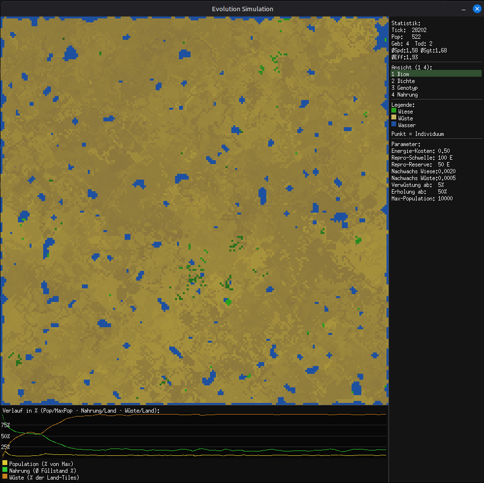
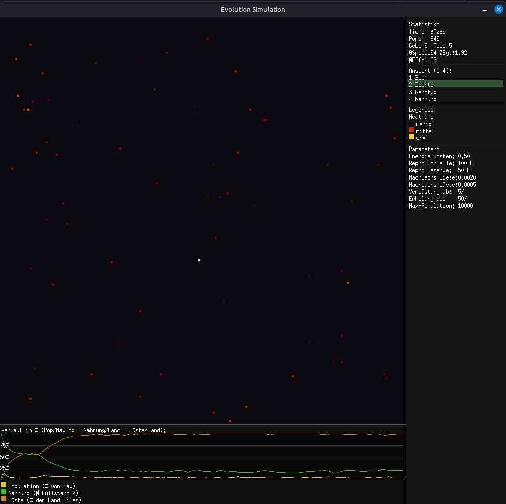
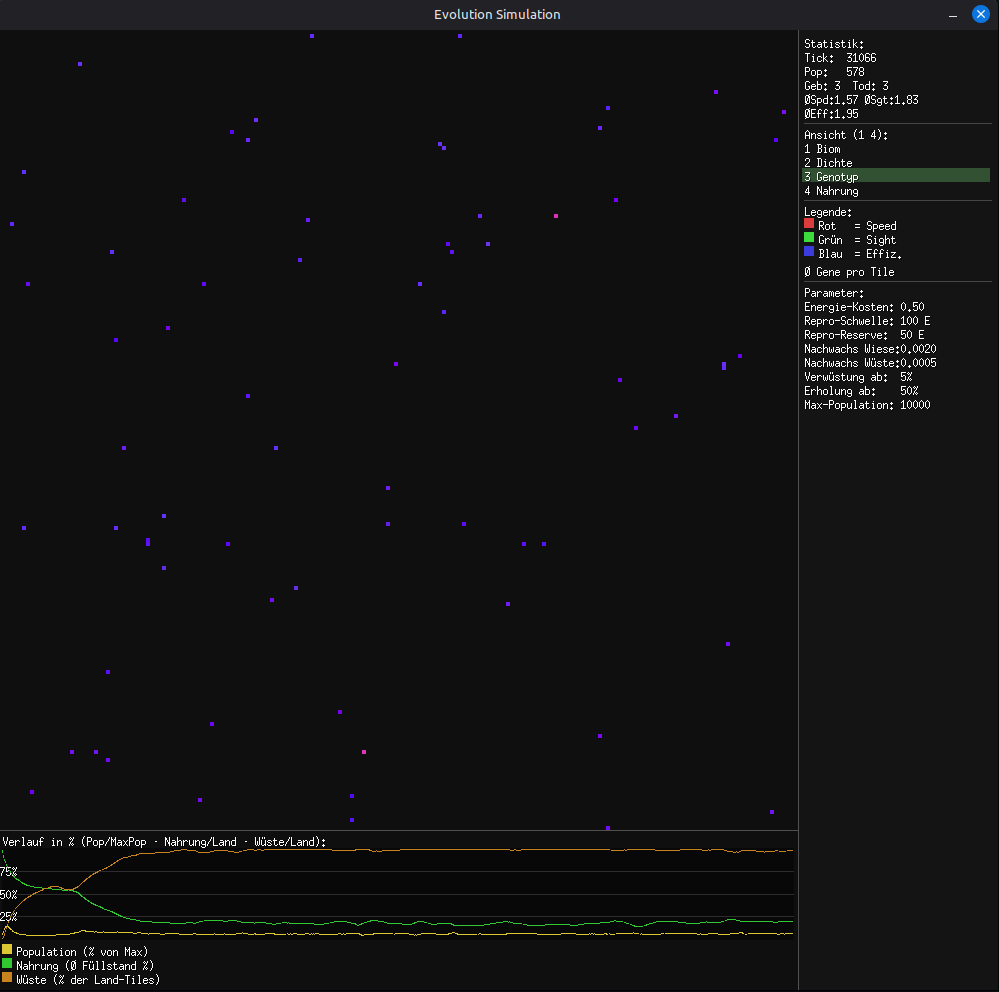
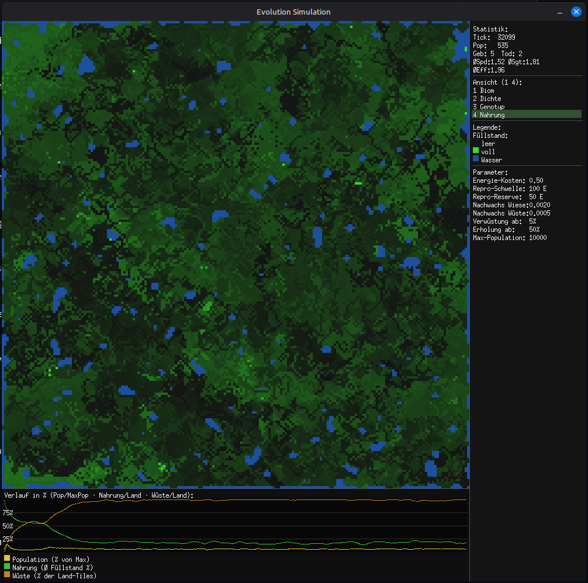

# Evolution Simulation

Eine biologisch inspirierte Echtzeit-Simulation, die grundlegende Prinzipien von **Leben** und **Evolution** sichtbar macht. Individuen leben auf einem 2D-Grid, suchen Nahrung, verbrauchen Energie und reproduzieren sich. Gene steuern ihr Verhalten — wer sich anpasst, überlebt. Natürliche Selektion entsteht ohne explizite Regel.

---

## Screenshots

| Biom | Dichte |
|---|---|
|  |  |

| Genotyp | Nahrung |
|---|---|
|  |  |

---

## Was passiert auf dem Bildschirm?

Die Welt besteht aus Wiesen, Wüsten und Wasser. Nahrung wächst langsam nach — wesentlich langsamer als eine gesunde Population frisst. Wo dauerhaft Nahrungsmangel herrscht, verwüstet das Gelände. Erholt sich die Nahrung, kehrt die Wiese zurück.

Vier Ansichten zeigen verschiedene Aspekte der laufenden Simulation:

| Taste | Ansicht | Was man sieht |
|---|---|---|
| `1` | **Biom** | Geländetyp, Nahrungsfüllstand, Individuen als Farbpunkte — **Räuber erscheinen rot** |
| `2` | **Dichte** | Populationsdichte pro Tile als Heatmap (schwarz → rot → gelb) |
| `3` | **Genotyp** | Ø Genwerte pro Tile als RGB — Rot = Speed, Grün = Sight, Blau = Effizienz |
| `4` | **Nahrung** | Nahrungsfüllstand biomunabhängig (dunkel = leer, grün = voll) |

Rechts: Statistiken (Population, Geburten/Tode, **Räuber-Anzahl, Kills**), aktiver Modus und Legende. Unten: Verlaufsdiagramm — Population, Nahrung, Verwüstung und **Räuber-Anteil** seit Simulationsstart.

---

## Steuerung

| Taste | Aktion |
|---|---|
| `Space` | Pause / Weiter |
| `→` | Einzelschritt (nur im Pause-Modus) |
| `1` – `4` | Ansicht wechseln |
| `Escape` | Beenden |

---

## Bauen und Starten

**Voraussetzungen:** Go 1.22+, GCC, X11-Entwicklungsbibliotheken

```bash
# Debian/Ubuntu
sudo apt install gcc libx11-dev libxcursor-dev libxrandr-dev libxinerama-dev \
                 libxi-dev libxxf86vm-dev

# Bauen und starten
make run
```

Nur bauen ohne Starten:
```bash
make build
./evolution
```

Tests ohne X11 (für CI-Umgebungen):
```bash
make test-sim
```

---

## Architektur

```
cmd/evolution
  └── ui ──────────────── render
        └── sim ──────── sim/partition ── sim/entity  ← Leaf
              └── sim/world ──────────── sim/entity
gen ──── sim/world
config ─ (keine Projekt-Imports)
```

Die Simulation läuft in einer Phase-1/Phase-2-Architektur: Phase 1 berechnet alle Aktionen parallel (Goroutinen pro Partition), Phase 2 wendet sie sequentiell an. Das garantiert Determinismus bei gleichem Seed und verhindert Data Races.

Details: [`docs/ARCHITECTURE.md`](docs/ARCHITECTURE.md) · [`docs/CONCEPT.md`](docs/CONCEPT.md) · [`docs/ROADMAP.md`](docs/ROADMAP.md) · [`docs/adr/`](docs/adr/)

---

## Meilensteine

| Meilenstein | Inhalt | Status |
|---|---|---|
| M0 | CI-Gates, Repo-Struktur | ✅ |
| M1–M4 | entity, config, world, gen | ✅ |
| M5–M7 | testutil, partition, sim | ✅ |
| M8–M10 | render, ui, cmd — **MVP** | ✅ |
| M11 | Räuber & Beute | ✅ |
| M12 | Umweltbedingungen | geplant |
| M13 | Karten-Editor | geplant |
| M14 | Detailansicht / Stammbaum | geplant |

---

## Beitragen

Willkommen! Bitte zuerst [`CONTRIBUTING.md`](CONTRIBUTING.md) lesen.
Für Bugs und Feature-Ideen bitte ein [Issue](../../issues) öffnen.

---

## Lizenz

[MIT](LICENSE)
